第3章 生物信息的传递(上)    
——从DNA 到RNA
3.1 RNA 的结构、分类和功能
3.1.1 RNA 的结构特点
3.1.2 RNA 在细胞中的分布
3.1.3 RNA 的功能
3.2 RNA 转录概述
3.2.1 RNA 转录与DNA复制的比较
3.2.2 转录机器的主要成分——RNA 聚合酶
3.2.3 启动子与转录起始
3.3 RNA转录的基本过程
3.3.1 模板识别
3.3.2 转录起始
3.3.3 转录延伸
3.3.4 转录终止
3.4 原核生物与真核生物的转录及产物特征比较
3.4.1 原核生物与真核生物转录过程比较
3.4.2 原核生物 mRNA的特征
3.4.3 真核生物 mRNA 的特征
3.5 原核生物 RNA 聚合酶与RNA 转录
3.5.1 原核生物 RNA 聚合酶
3.5.2 原核生物启动子结构

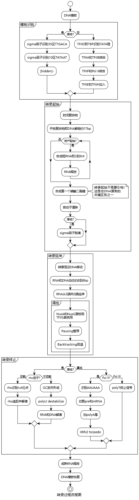
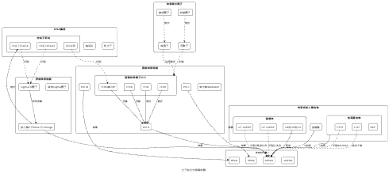
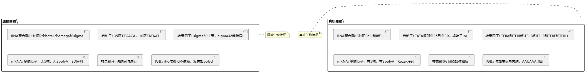
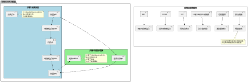
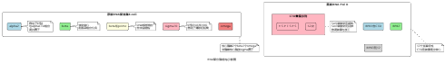
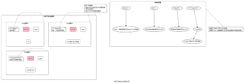
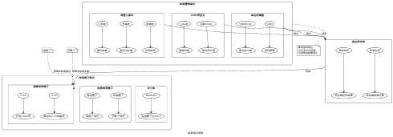

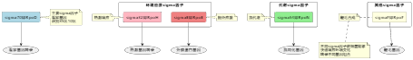
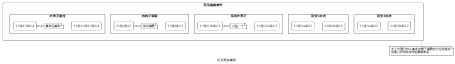
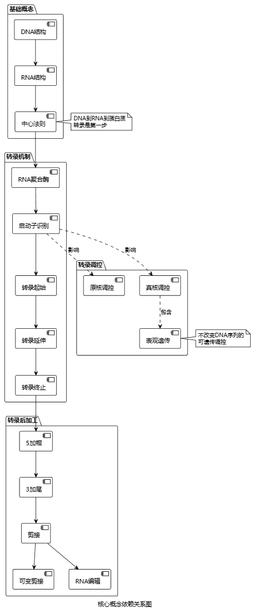
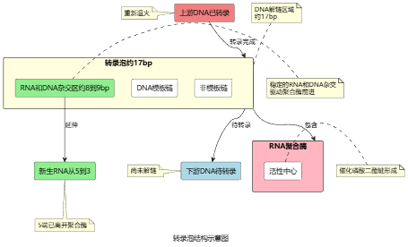